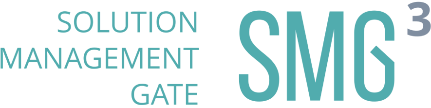

 

  

 

  

 

  <h2>U5.JS Solution Management Gate</h2>

SMG Proxy - NestJS-based proxy server for SMG API. Built on top of Fastify, using Dependency Injection pattern and 

GraphQL standard. API Endpoint: [Heroku](https://smg-graphql-proxy.herokuapp.com/graphql)

## Requirements
- NodeJS 14.x.x or higher
- Typescript Compiler 4.x.x or higher
- NestJS CLI

## Useful scripts
    yarn start:dev //Staring project in development mode
    yarn start:prod //Staring project in production mode
    yarn lint //Lint checks
    yarn prettier:write //Prettifying code

## GraphQL schema generation
  In this project we are using code-first approach. This means that schema and all necessary types will be automatically generated by NestJS CLI in compile time, so if you want to add a new resolver - just create a new class with @Resolver annotation and add it to AppModule includes.
  
## Contributing
Create a PR using [this](docs/pull_request_template.md) template, wait for approvals from other devs & checkers, if all is fine - you're ready to merge!

## Links
- [Bitbucket Jira](https://itechart-smg.atlassian.net) - Jira page with project tasks
- [Bitbucket Confluence](https://itechart-smg.atlassian.net/wiki/spaces/SMG/pages/65785/SMG+App+Architecture) - Documentation pages
- [Bitrise Android](https://app.bitrise.io/app/f005ca26c0884ad6#/builds) - Bitrise CI/CD Android project
- [Bitrise iOS](https://app.bitrise.io/app/39af897e63f33a72#/builds ) - Bitrise CI/CD iOS project
- [Codacy](https://app.codacy.com/gh/TheLonelyAstronaut/ITA-SMG-App/dashboard?branch=dev) - Codecheck project
- [App](https://github.com/TheLonelyAstronaut/ITA-SMG-App) - Kotlin Multiplatform Mobile App
- [Staging](https://github.com/TheLonelyAstronaut/ITA-SMG-Mock-API) - Mock of SMG API for staging
- [Design](https://www.figma.com/file/eEsJ0WJqG5xRczdYtMr7BG/iTA-SMG-Mobile) - Figma project (Work in Progress)
